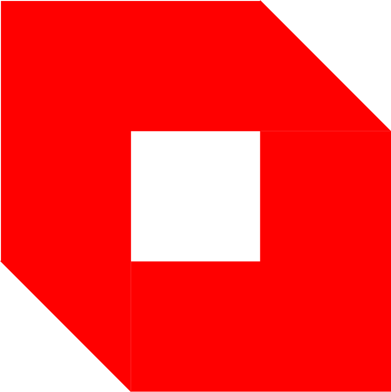

<p align="center">
  
  <h1 align="center">QAMO</h1>
</p>

**Q**uantified **A**sset **M**anagement **O**ptions is a free multi-market, multi-asset data analyzer dashboard developed with flask. However, I might eventually migrate to Django.

## Markets
- Tehran stock exchange
- cryptocurrency market
- gold, and global markets

## Notice
QAMO is an offspring of previous tiny projects I conducted individually in the past. In the first phase, it would manage to rerun the previously written code. As the project grows, I will improve its reusability, maintenance, and development. 

## How to run
Install requirements
```
pip install -r requirements.txt
```
Run the Flask app
```
python app.py
```

## Disclaimer
QAMO is for personal use, and it does not certify any results. Please don't use the results. I renounce any financial inference or trading outcomes you might have based on QAMO's results.
